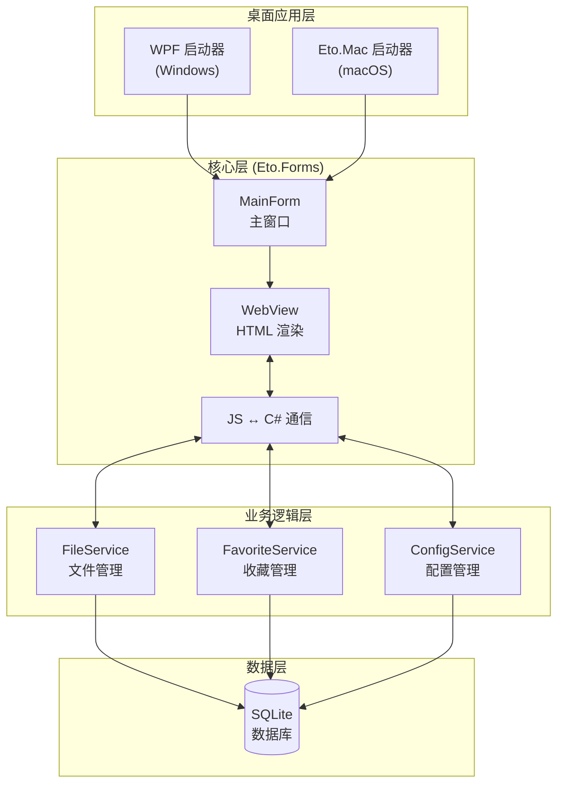
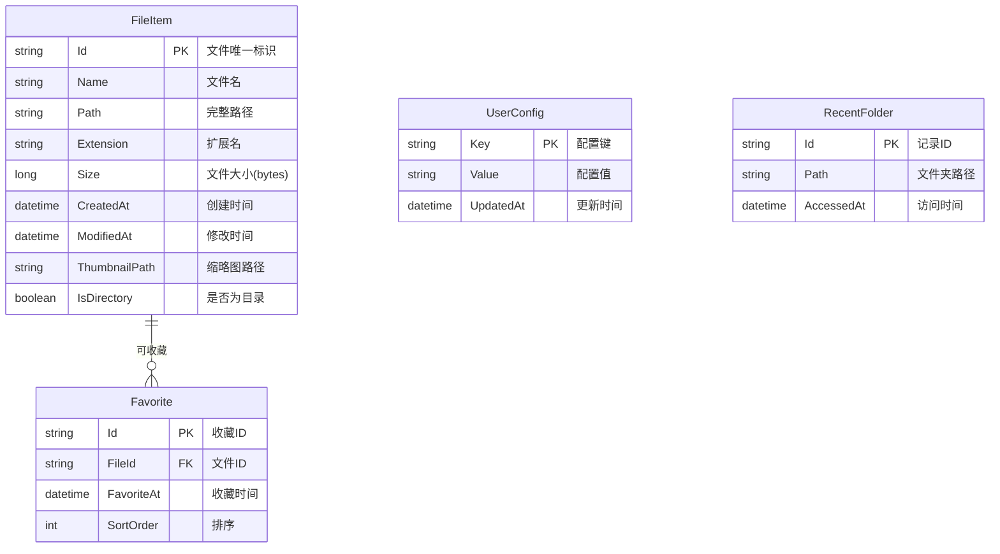

# 项目设计文档 - ProjectFileManager

## 1. 系统架构



## 2. 数据模型



## 3. 接口清单

### 3.1 文件管理接口 (JS → C#)

| 方法 | 描述 |
|------|------|
| `getDirectoryTree(rootPath)` | 获取目录树结构 |
| `getFiles(directoryPath, page, pageSize)` | 分页获取文件列表(懒加载) |
| `openFile(filePath, withShift)` | 打开文件，支持 Shift 键检测 |
| `getThumbnail(filePath)` | 获取文件缩略图 |
| `searchFiles(keyword)` | 搜索文件 |
| `refresh()` | 刷新当前目录 |

### 3.2 收藏管理接口

| 方法 | 描述 |
|------|------|
| `toggleFavorite(fileId)` | 切换收藏状态 |
| `getFavorites()` | 获取收藏列表 |
| `isFavorite(fileId)` | 检查是否已收藏 |

### 3.3 配置管理接口

| 方法 | 描述 |
|------|------|
| `getConfig(key)` | 获取配置 |
| `setConfig(key, value)` | 设置配置 |
| `getItemsPerRow()` | 获取每行显示数量 |
| `setItemsPerRow(count)` | 设置每行显示数量 |

## 4. 页面清单

| 页面 | 功能描述 |
|------|---------|
| 主界面 | 三栏布局：左侧目录树 + 右侧文件预览区 + 底部工具栏 |
| 目录树 | 递归展示文件夹结构，支持展开/折叠 |
| 文件预览区 | 网格展示文件缩略图，支持收藏、更多操作、双击打开 |
| 底部工具栏 | 刷新、搜索、保存、滑块(调节每行数量) |
| 更多选项菜单 | 打开、复制路径、在文件夹中显示、属性 |

## 5. 示例数据规划

### 5.1 模拟文件数据（10 条）
- 用于开发阶段的模拟文件列表
- 包含不同类型：图片、文档、视频、音频、文件夹
- 模拟缩略图使用 SVG 占位图标

### 5.2 配置数据（默认值）
- `itemsPerRow`: 4（默认每行 4 个）
- `lastOpenedPath`: 用户主目录
- `theme`: light

## 6. 前端设计规范（遵循 frontend-master 标准）

### 6.1 设计方向
- **美学风格**：现代简约 + 毛玻璃层叠 (Glassmorphism Light)
- **设计关键词**：专业、清晰、高效、现代、沉浸
- **情绪参考**：VS Code 文件管理器 + macOS Finder 的融合体验

### 6.2 色彩体系

```css
:root {
  /* 主色 - 深蓝色，用于选中状态和强调 */
  --color-primary-50: #eff6ff;
  --color-primary-100: #dbeafe;
  --color-primary-200: #bfdbfe;
  --color-primary-300: #93c5fd;
  --color-primary-400: #60a5fa;
  --color-primary-500: #3b82f6;
  --color-primary-600: #2563eb;
  --color-primary-700: #1d4ed8;
  --color-primary-800: #1e40af;
  --color-primary-900: #1e3a8a;
  
  /* 中性色 - 冷灰色系 */
  --color-neutral-50: #f8fafc;
  --color-neutral-100: #f1f5f9;
  --color-neutral-150: #e8eef4;
  --color-neutral-200: #e2e8f0;
  --color-neutral-300: #cbd5e1;
  --color-neutral-400: #94a3b8;
  --color-neutral-500: #64748b;
  --color-neutral-600: #475569;
  --color-neutral-700: #334155;
  --color-neutral-800: #1e293b;
  --color-neutral-900: #0f172a;
  
  /* 强调色 - 琥珀色，用于收藏星标 */
  --color-accent-400: #fbbf24;
  --color-accent-500: #f59e0b;
  --color-accent-600: #d97706;
  
  /* 语义色 */
  --color-success: #22c55e;
  --color-warning: #f59e0b;
  --color-error: #ef4444;
  --color-info: #3b82f6;
  
  /* 60-30-10 法则分配 */
  /* 60% 底色: neutral-50 ~ neutral-100 */
  /* 30% 辅色: neutral-200 ~ neutral-300 */
  /* 10% 强调色: primary-500, accent-500 */
}
```

### 6.3 字体体系

```css
:root {
  /* 字体族 */
  --font-sans: 'Inter Variable', 'SF Pro Display', -apple-system, BlinkMacSystemFont, 'Segoe UI', sans-serif;
  --font-mono: 'JetBrains Mono', 'SF Mono', 'Fira Code', monospace;
  
  /* 字号阶梯 */
  --text-xs: 11px;
  --text-sm: 12px;
  --text-base: 13px;
  --text-lg: 14px;
  --text-xl: 16px;
  --text-2xl: 18px;
  --text-3xl: 22px;
  
  /* 行高 */
  --leading-tight: 1.25;
  --leading-normal: 1.5;
  --leading-relaxed: 1.625;
  
  /* 字重 */
  --font-normal: 400;
  --font-medium: 500;
  --font-semibold: 600;
  --font-bold: 700;
}
```

### 6.4 间距与布局

```css
:root {
  /* 4px 基准间距阶梯 */
  --spacing-0: 0;
  --spacing-1: 4px;
  --spacing-2: 8px;
  --spacing-3: 12px;
  --spacing-4: 16px;
  --spacing-5: 20px;
  --spacing-6: 24px;
  --spacing-8: 32px;
  --spacing-10: 40px;
  --spacing-12: 48px;
  
  /* 布局尺寸 */
  --sidebar-width: 240px;
  --toolbar-height: 48px;
  --file-item-min-width: 120px;
  --file-item-max-width: 200px;
}
```

### 6.5 组件规范

```css
:root {
  /* 圆角 */
  --radius-sm: 4px;
  --radius-md: 6px;
  --radius-lg: 8px;
  --radius-xl: 12px;
  
  /* 阴影层级 */
  --shadow-sm: 0 1px 2px 0 rgb(0 0 0 / 0.05);
  --shadow-md: 0 4px 6px -1px rgb(0 0 0 / 0.1), 0 2px 4px -2px rgb(0 0 0 / 0.1);
  --shadow-lg: 0 10px 15px -3px rgb(0 0 0 / 0.1), 0 4px 6px -4px rgb(0 0 0 / 0.1);
  --shadow-xl: 0 20px 25px -5px rgb(0 0 0 / 0.1), 0 8px 10px -6px rgb(0 0 0 / 0.1);
  
  /* 边框 */
  --border-color: var(--color-neutral-200);
  --border-width: 1px;
  
  /* 卡片样式 */
  --card-bg: white;
  --card-border: var(--border-color);
  --card-shadow: var(--shadow-sm);
  --card-hover-shadow: var(--shadow-md);
}
```

### 6.6 动效规范

```css
:root {
  /* 过渡时长 */
  --duration-fast: 150ms;
  --duration-normal: 250ms;
  --duration-slow: 400ms;
  
  /* 缓动函数 */
  --ease-out: cubic-bezier(0.33, 1, 0.68, 1);
  --ease-in-out: cubic-bezier(0.65, 0, 0.35, 1);
  --ease-spring: cubic-bezier(0.34, 1.56, 0.64, 1);
}
```

**三层动效设计**：
- **页面级**：目录切换淡入淡出过渡
- **区块级**：文件网格交错入场动画（stagger 50ms）
- **元素级**：文件项 hover 缩放（1.02x）+ 阴影提升

### 6.7 平台适配说明

| 平台 | 特殊处理 |
|------|---------|
| Windows (WPF) | 使用系统窗口装饰，支持 Win11 圆角 |
| macOS | 使用原生标题栏样式，支持全屏模式 |
| 通用 | WebView 内容完全一致，通过 JS Bridge 适配平台差异 |

### 6.8 图片与媒体资源清单

| 资源类型 | 数量 | 关键词/说明 |
|---------|------|------------|
| 文件类型图标 | 15+ | SVG 矢量图标（文件夹、图片、视频、音频、文档、代码等） |
| 工具栏图标 | 8 | SVG（刷新、搜索、保存、设置、收藏、更多等） |
| 空状态插图 | 1 | 空文件夹提示 |
| 占位缩略图 | 1 | 加载中骨架屏 |
